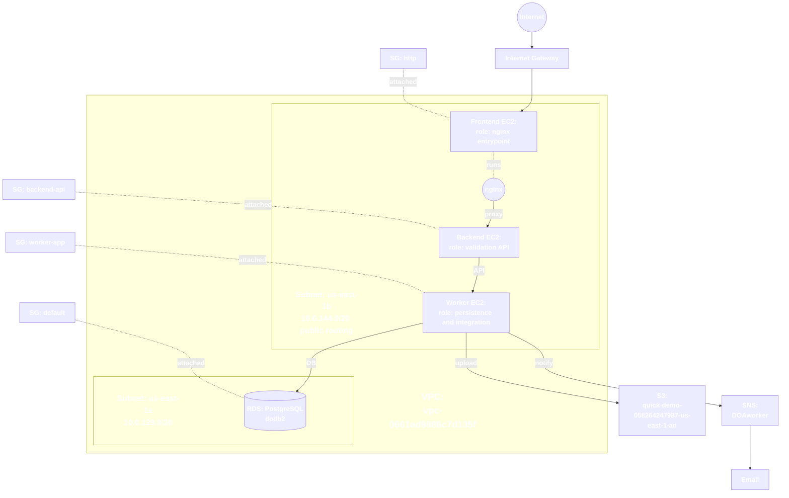

## Overview

This project implements a small AWS-based infrastructure automation application built from three EC2-hosted services:

- **Frontend** – public web entry point served by **nginx**
- **Backend** – validation and orchestration API
- **Worker** – persistence, database, S3, and notification service

The application is split by responsibility under `src/` and is designed so each service has a clear role in the overall system.

## Short architecture explanation

The architecture is based on three EC2 instances inside one AWS VPC:

- the **frontend EC2** is the public-facing machine and runs nginx
- the **backend EC2** receives validated requests from the frontend
- the **worker EC2** performs persistence and integration tasks
- **RDS PostgreSQL** stores machine records
- **S3** stores the synchronized machine catalog file
- **SNS** sends notifications when worker-side processing completes

User traffic enters through nginx on the frontend EC2. nginx proxies API requests to the backend. The backend validates and prepares machine data, then forwards it to the worker. The worker stores the catalog in PostgreSQL, updates the JSON catalog file, uploads the file to S3, and publishes notifications through SNS.

## System components

### Frontend EC2

- public entry point of the application
- runs **nginx**
- serves `src/frontend/index2.html`
- proxies API requests such as `/health`, `/machines`, and `/schema/` to the backend

### Backend EC2

- runs the backend FastAPI service
- validates machine input
- assigns machine IDs
- exposes read and write API endpoints
- forwards machine-processing requests to the worker service

### Worker EC2

- runs the worker FastAPI service
- stores and reads machine records
- synchronizes machine data between JSON, PostgreSQL, and S3
- publishes SNS notifications
- exposes maintenance functionality such as recataloguing machine IDs

### RDS PostgreSQL

- stores machine records in the `machines` table
- acts as the authoritative persistent database when PostgreSQL mode is enabled
- is currently public so pgAdmin access can be used directly

### S3

- stores the synchronized machine catalog file
- receives uploads from the worker after machine processing and maintenance operations

### SNS

- sends notifications generated by the worker
- is connected to the email topic already used by the project

### nginx

- runs on the frontend EC2
- serves the frontend HTML page
- acts as reverse proxy between browser traffic and backend API routes

## Project structure

```text
configs/
scripts/
src/
  backend/
  worker/
  frontend/
  shared/
```

The active application layout is:

- `src/backend/`
- `src/worker/`
- `src/frontend/`
- `src/shared/`

## Architecture diagram



## Connections between the services

The service flow is:

1. the browser reaches the **frontend EC2** over HTTP
2. **nginx** serves the static frontend page
3. nginx proxies API requests to the **backend**
4. the **backend** validates the request and forwards processing to the **worker**
5. the **worker** stores machine data in **RDS PostgreSQL**
6. the worker updates the catalog file and uploads it to **S3**
7. the worker publishes a completion notification to **SNS**
8. SNS forwards the notification to email

## Setup and run instructions

### Project setup in a development environment

Clone the repository and create a Python virtual environment:

```bash
git clone https://github.com/ZeR0W1/DevOpsProject1.git
cd DevOpsProject1
python -m venv venv
source venv/bin/activate  # Linux
# or: venv\Scripts\Activate  # Windows
pip install -r src/backend/requirements.txt
pip install -r src/worker/requirements.txt
```

If you want to work only on a specific service directory on a machine, you can use sparse checkout.

### Sparse checkout examples for EC2 instances

#### Frontend EC2

```bash
git clone --filter=blob:none --no-checkout https://github.com/ZeR0W1/DevOpsProject1.git infra-automation
cd infra-automation
git sparse-checkout init --cone
git sparse-checkout set src/frontend
git checkout aws-assignment1
```

Further frontend instructions: [Frontend README](src/frontend/README.md)

#### Backend EC2

```bash
git clone --filter=blob:none --no-checkout https://github.com/ZeR0W1/DevOpsProject1.git infra-automation
cd infra-automation
git sparse-checkout init --cone
git sparse-checkout set src/backend src/shared
git checkout aws-assignment1
```

Further backend instructions: [Backend README](src/backend/README.md)

#### Worker EC2

```bash
git clone --filter=blob:none --no-checkout https://github.com/ZeR0W1/DevOpsProject1.git infra-automation
cd infra-automation
git sparse-checkout init --cone
git sparse-checkout set src/worker src/shared configs
git checkout aws-assignment1
```

Further worker instructions: [Worker README](src/worker/README.md)


### Frontend / nginx

The frontend page is `src/frontend/index2.html` and nginx uses `src/frontend/nginx.conf`.

Public entry point:

```text
http://44.212.221.75/
```

### systemd services

The deployed EC2 instances use systemd units for the backend and worker services, and nginx as the frontend web server.

## Use of nginx, RDS, S3, and SNS in the application

### nginx

- hosts the frontend HTML page
- exposes the public application endpoint
- proxies browser API traffic to the backend

### RDS

- stores machine records in PostgreSQL
- is used by the worker for persistent machine storage
- currently remains public to allow direct pgAdmin access

### S3

- stores the synchronized `instances.json` catalog copy
- receives uploads from the worker after processing or recataloguing

### SNS

- sends application notifications from the worker
- is used to notify by email when worker-side operations complete

## Deployment notes

- Frontend nginx config: `src/frontend/nginx.conf`
- Backend code: `src/backend/`
- Worker code: `src/worker/`
- PostgreSQL CA bundle path: `src/worker/global-bundle.pem`
- Active EC2 security groups:
  - Front: `http`
  - Back: `backend-api`
  - Worker: `worker-app`
- Active security-group flow:
  - `http` allows inbound `80/tcp` from the internet
  - `backend-api` allows inbound `8000/tcp` from SG `http`
  - `worker-app` allows inbound `8000/tcp` from SG `backend-api`
  - RDS SG `default` allows `5432/tcp` from SG `worker-app` and from the admin IP used for pgAdmin

## Service documentation

- Frontend: [src/frontend/README.md](src/frontend/README.md)
- Backend: [src/backend/README.md](src/backend/README.md)
- Worker: [src/worker/README.md](src/worker/README.md)


## Manual evidence to capture

- screenshots of running EC2 instances
- screenshots of RDS, S3, SNS, and the nginx-exposed frontend
- notes for any non-minimal IAM or security group rules