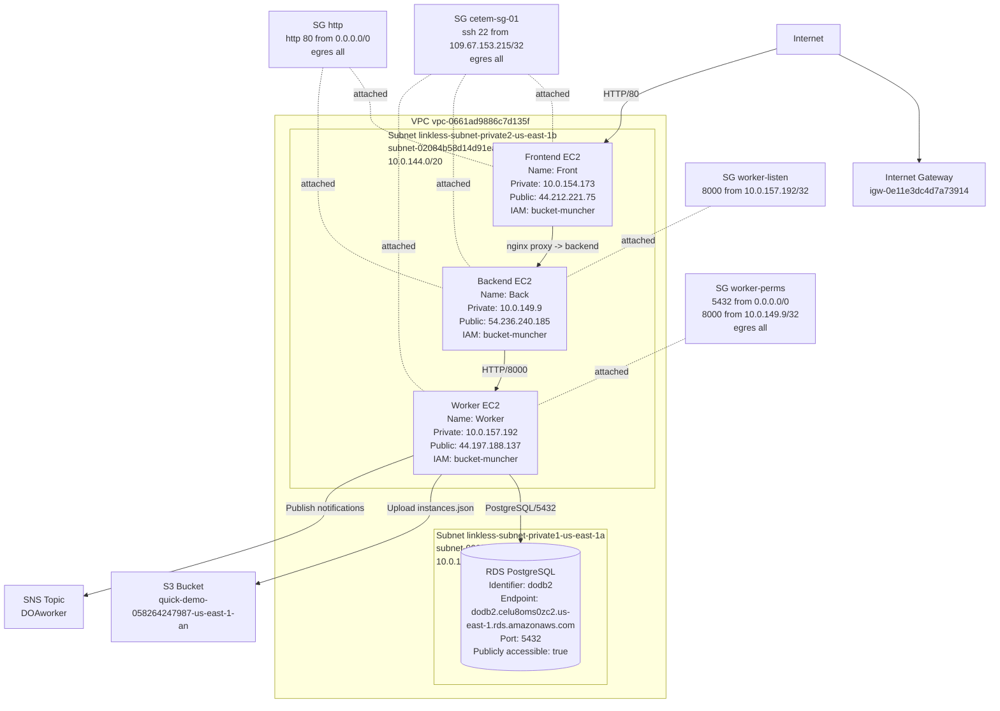

## Overview

This repository is organized around three AWS-hosted services:

- **Frontend**: public nginx entry point
- **Backend**: validation and orchestration API
- **Worker**: persistence, S3 sync, and SNS notification service

The intended layout is under `src/`.

## Service documentation

- Frontend: `src/frontend/README.md`
- Backend: `src/backend/README.md`
- Worker: `src/worker/README.md`

## Project structure

```text
configs/
scripts/
src/
  backend/
  worker/
  frontend/
  legacy/
```

`src/legacy/` keeps the previous single-source/local-testing implementation during the migration to the per-service layout. It is retained for reference and fallback, but the intended active structure is `src/backend/`, `src/worker/`, and `src/frontend/`.

## Architecture diagram



## Deployment notes

- Public frontend entry point: `http://44.212.221.75/`
- Frontend nginx config: `src/frontend/nginx.conf`
- Backend validation lives in `src/backend/`
- Worker persistence/integration logic lives in `src/worker/`
- PostgreSQL CA bundle is expected at `src/worker/global-bundle.pem`

## Local development

```bash
python -m venv venv
source venv/bin/activate  # Linux
# or: venv\Scripts\Activate  # Windows
pip install -r requirements-backend.txt
pip install -r requirements-worker.txt
```


## Manual evidence to capture

- screenshots of running EC2 instances
- screenshots of RDS, S3, SNS, and the nginx-exposed frontend
- notes for any non-minimal IAM or security group rules