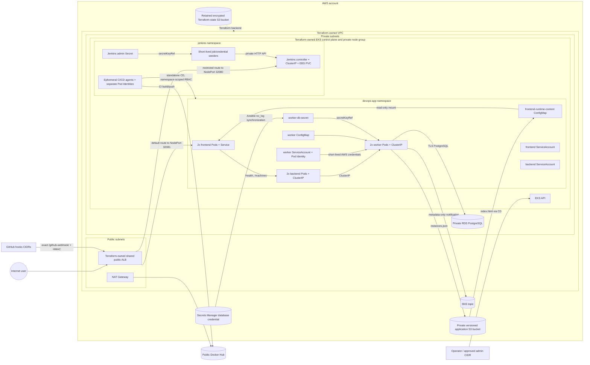

# DevOps on AWS: Kubernetes, EKS, and Jenkins


## Project goal

This project runs a three-service application on Amazon EKS:

- **frontend** — nginx-hosted browser UI and the only generally public
  application entry point;
- **backend** — internal FastAPI validation/orchestration service;
- **worker** — internal FastAPI persistence and integration service;
- **RDS PostgreSQL** — primary structured datastore;
- **S3** — initial `index.html` content and synchronized `instances.json` backup;
- **SNS** — application notifications; and
- **Jenkins** — mandatory CI with a separately controlled optional CD job.

## Ownership and lifecycle boundaries

- **Terraform owns AWS infrastructure**: VPC networking, EKS, RDS, S3, SNS,
  Secrets Manager, and AWS identity integrations.
- **Ansible is the routine lifecycle orchestrator**. The guarded create flow is
  implemented through the top-level `create.yml` wrapper; lower-level stages stay
  composable and default-off when invoked independently.
- **Jenkins CI and CD remain separate**. `Jenkins/Jenkinsfile.eks` checks code and
  charts and builds one immutable tag for all three images. CD through
  `Jenkins/Jenkinsfile-deploy` is optional and is the only Jenkins job allowed to
  change application workloads. CI may seed or explicitly reset the versioned S3
  `index.html`; CD is the sole owner of the S3-to-Kubernetes content activation.
- **Helm deploys three independent releases** from `helm/frontend`,
  `helm/backend`, and `helm/worker`.

## Target architecture


```mermaid
flowchart LR
    User((Internet user)) --> ALB[Terraform-owned shared public ALB]
    GitHub[GitHub hooks CIDRs] -->|exact /github-webhook/ + HMAC| ALB
    Operator[Operator / approved admin CIDR] --> EKSAPI[EKS API]
    Registry[(Public Docker Hub)]

    subgraph AWS[AWS account]
      State[(Retained encrypted Terraform-state S3 bucket)]

      subgraph VPC[Terraform-owned VPC]
        subgraph Public[Public subnets]
          ALB
          NAT[NAT Gateway]
        end

        subgraph Private[Private subnets]
          subgraph EKS[Terraform-owned EKS control plane and private node group]
            EKSAPI
            subgraph AppNS[devops-app namespace]
              Front[2x frontend Pods + Service]
              Back[2x backend Pods + ClusterIP]
              Worker[2x worker Pods + ClusterIP]
              FrontCM[frontend-runtime-content ConfigMap]
              RuntimeCM[worker ConfigMap]
              DbSecret[worker-db-secret]
              FrontSA[frontend ServiceAccount]
              BackSA[backend ServiceAccount]
              WorkerSA[worker ServiceAccount + Pod Identity]
            end

            subgraph JenkinsNS[jenkins namespace]
              Jenkins[Jenkins controller + ClusterIP + EBS PVC]
              Agents[Ephemeral CI/CD agents + separate Pod Identities]
              Seeder[Short-lived job/credential seeders]
              AdminSecret[Jenkins admin Secret]
            end
          end

          RDS[(Private RDS PostgreSQL)]
        end
      end

      Bucket[(Private versioned application S3 bucket)]
      Topic[(SNS topic)]
      Secrets[(Secrets Manager database credential)]
    end

    ALB -->|default route to NodePort 32081| Front
    ALB -->|restricted route to NodePort 32080| Jenkins
    Front -->|/health, /machines| Back
    Back -->|ClusterIP| Worker
    Worker -->|TLS PostgreSQL| RDS
    WorkerSA -->|short-lived AWS credentials| Worker
    Worker -->|instances.json| Bucket
    Worker -->|metadata-only notification| Topic
    Bucket -->|index.html via CD| FrontCM
    FrontCM -->|read-only mount| Front
    RuntimeCM --> Worker
    Secrets -->|Ansible no_log synchronization| DbSecret
    DbSecret -->|secretKeyRef| Worker
    NAT --> Registry
    Agents -->|CI build/push| Registry
    Agents -->|standalone CD, namespace-scoped RBAC| AppNS
    AdminSecret -->|secretKeyRef| Seeder
    Seeder -->|private HTTP API| Jenkins
    State -. Terraform backend .-> VPC
```

Target Kubernetes invariants include two replicas per service, readiness/liveness
probes, resource requests/limits, non-root least-privilege security contexts,
separate ServiceAccounts, an internal backend and worker, and a private RDS/S3/SNS
trust boundary.

The Kubernetes-specific diagram, chart ownership contract, pod hardening,
NetworkPolicy traffic matrix, release order, and chart verification commands are
maintained in the [Helm application guide](helm/README.md).

## Repository map

| Path | Purpose |
| --- | --- |
| `terraform/` | Main AWS stack; partial S3 backend configuration |
| `terraform/state-bootstrap/` | Separate retained Terraform-state bucket root |
| `setup.sh` | One-time pinned local tool and private-input setup |
| `Ansible-modules-01/playbooks/create.yml` | Complete guarded create lifecycle |
| `Ansible-modules-01/playbooks/create/` | Internal create stages and ordered lifecycle |
| `Ansible-modules-01/playbooks/create/setup/` | Operator-invoked local setup and CIDR maintenance helpers |
| `Ansible-modules-01/playbooks/destroy.yml` | Guarded normal/resume destroy entry point |
| `Ansible-modules-01/playbooks/destroy/` | Internal destroy stages and ordered lifecycle |
| `Jenkins/Jenkinsfile.eks` | Mandatory EKS-native CI pipeline |
| `Jenkins/Jenkinsfile-deploy` | Optional standalone CD pipeline |
| `helm/frontend`, `helm/backend`, `helm/worker` | Independent application charts |
| `app/src/` | Application source |

The repository default frontend source is
`app/src/frontend/index.html`. The authoritative
runtime source is the Terraform-owned, versioned S3 object `index.html`.

## Jenkins model

CI runs blocking Bandit, Flake8, pytest/JUnit, Helm, and source-build Trivy gates,
then builds all three images with Kaniko under one immutable tag and records their
digests. CD remains a separate job and is the only Jenkins path with
namespace-scoped application mutation permission.

The shared ALB sends only GitHub `hooks` CIDRs on exact `/github-webhook/` to the
fixed webhook NodePort; HMAC validation is mandatory. Jenkins' normal Service is
ClusterIP-only. For temporary UI access, use a local port-forward and the
confirmation-gated login helper:

```bash
kubectl --kubeconfig Ansible-modules-01/recovery/target-kubeconfig \
  -n jenkins port-forward svc/jenkins 18080:8080
```

In a separate terminal, retrieve the current administrator login only when it is
needed:

```bash
bash scripts/show_jenkins_login.sh
```

Do not run the credential helper while screen sharing or capture its output.

### Frontend runtime content

CI seeds the versioned S3 `index.html` only when absent unless an explicit reset
is requested. Standalone CD supports `FULL` application deployment and
`CONTENT_ONLY` ConfigMap activation. Its manual-only `ROLLBACK` mode requires one
positive Helm revision that exists for all three application releases. CD validates
the historical manifests and immutable image references before running namespace-
scoped `helm rollback`, then waits for every rollout, verifies the restored images,
and runs the same functional smoke test. Because frontend runtime content is owned
outside Helm, rollback deliberately leaves the external ConfigMap unchanged. The
frontend mounts that ConfigMap read-only; CI/CD use separate least-privilege Pod
Identity roles and CD has only namespace-scoped Kubernetes RBAC. The external
ConfigMap/chart ownership details are documented in the
[Helm application guide](helm/README.md).

## Setup, create, and destroy

The setup host must be Linux x86_64. On Ubuntu or Debian:

```bash
sudo apt-get update
sudo apt-get install -y \
  bash ca-certificates curl git openssl python3 python3-venv \
  tar unzip coreutils gawk grep
```

Use an administrable HTTPS GitHub clone, temporary AWS credentials where possible,
a fine-grained GitHub token limited to repository **Webhooks: Read and write**,
and a Docker Hub write token only for build mode. Never place credentials in Git,
command arguments, CI parameters, or documentation.

Run setup from the repository root:

```bash
bash setup.sh
source .venv/bin/activate
```

Setup installs pinned project-local tools and creates ignored mode-`0600` local
configuration and Ansible Vault files. Configure AWS authentication after
activating `.venv`; for example:

```bash
aws configure sso --profile devops-project
aws sso login --profile devops-project
export AWS_PROFILE=devops-project
```

Verify the selected identity before any infrastructure command:

```bash
aws sts get-caller-identity
aws configure get region
```

Run the guarded lifecycle from its authoritative Ansible root:

```bash
cd Ansible-modules-01
export ANSIBLE_CONFIG="$PWD/ansible.cfg"
ansible-playbook playbooks/create.yml
```

Choose `DEPLOY_DEFAULT` for promoted images or `BUILD_AND_DEPLOY` for source-built
images. Review the displayed account, region, billable scope, state boundary, TLS
mode, repository, and branch before typing `CREATE`. The lifecycle never imports,
adopts, or deletes name collisions automatically.

Destroy remains default-off. A harmless inspection run is:

```bash
ansible-playbook playbooks/destroy.yml
```

An enabled destroy requires `DESTROY_EXECUTE=true` and exact `DESTROY`
confirmation; `RETAIN_APPLICATION_DATA=true` optionally backs up the two
application objects. It purges the verified dedicated cluster in dependency order,
runs one state-driven Terraform destroy, and retains the separate state bucket.
After a fail-closed partial Terraform failure, resume with:

```bash
DESTROY_EXECUTE=true DESTROY_RESUME=true ansible-playbook playbooks/destroy.yml
```

See the [Ansible lifecycle guide](Ansible-modules-01/README.md) for setup files,
CIDR refresh, create/destroy gates, backup behavior, and private Jenkins access;
see the [Terraform guide](terraform/README.md) for state and ownership boundaries.

## Operational verification

Use the ignored target kubeconfig generated by the lifecycle. If it is not already
exported in the current shell:

```bash
export KUBECONFIG="$PWD/recovery/target-kubeconfig"
```

After CI and standalone FULL CD succeed, verify that nodes are healthy, all
application replicas are Ready, and the fixed frontend/webhook NodePorts are the
only shared-ALB targets:

```bash
kubectl get nodes -o wide
kubectl get namespaces
kubectl get pods -n devops-app -o wide
kubectl get deployments -n devops-app -o wide
kubectl get services -n devops-app -o wide
kubectl describe pod <worker-pod> -n devops-app
kubectl logs <worker-pod> -n devops-app --tail=20
```

The frontend Service uses fixed NodePort `32081`; the dedicated Jenkins webhook
Service uses `32080`, while the normal Jenkins Service remains ClusterIP. Confirm
the Terraform-output ALB hostname and listener rules without printing state or
secret values. Operational output must never expose Secrets, tokens, Terraform
state, saved plans, or private input files.

For functional verification, derive the current frontend hostname rather than
storing an ephemeral URL in documentation:

```bash
PUBLIC_URL=$(terraform -chdir=terraform output -raw public_url)
curl -fsS "${PUBLIC_URL}/health"
curl -fsS "${PUBLIC_URL}/machines"
```

The `/health` response identifies `backend-api`, proving frontend nginx proxying to
the internal backend. A machine created once through the browser form traverses
frontend -> backend -> worker, is read back from PostgreSQL, is synchronized to
fixed versioned S3 object `instances.json`, and emits an SNS message containing
only `event`, `machine_count`, and `object_key` metadata.

For a controlled application rollback, use only the standalone Jenkins CD job.
First inspect `helm history` for all three releases and choose a prior positive
revision common to `frontend`, `backend`, and `worker`. Run CD with
`DEPLOY_MODE=ROLLBACK`, that `ROLLBACK_REVISION`, the fixed `devops-app` namespace,
and `CONFIRM_DEPLOY=true`. The job rejects a missing revision or a historical
`latest` image, records the target manifests and images, performs each Helm
rollback, verifies all rollouts and restored image references, and repeats the
functional smoke test. Do not run ad-hoc operator `helm rollback` commands during
normal operation because CD is the application workload owner. If rollback fails,
inspect the archived Helm/workload/event diagnostics and rerun the CD job against
the last verified common revision; never rebuild an old image in CD.

For a deliberate self-healing test, first preserve the original pod listing and
obtain explicit approval. Delete exactly one worker pod, confirm that its
Deployment creates a replacement with a different name and restores both replicas
to Ready, then re-read the same machine through `/machines` to verify continued
operation and PostgreSQL persistence.

## Safe local validation

The following commands are intended for local/static validation. They do not
authorize a Terraform plan/apply, backend initialization, cloud mutation, secret
sync, or enabled destroy:

```bash
terraform -chdir=terraform fmt -check -recursive
terraform -chdir=terraform validate
terraform -chdir=terraform/state-bootstrap fmt -check
terraform -chdir=terraform/state-bootstrap validate

cd Ansible-modules-01
ANSIBLE_CONFIG="$PWD/ansible.cfg" ansible-playbook --syntax-check playbooks/create.yml
ANSIBLE_CONFIG="$PWD/ansible.cfg" ansible-playbook --syntax-check playbooks/destroy.yml
cd ..

```

See [`terraform/README.md`](terraform/README.md) and
[`Ansible-modules-01/README.md`](Ansible-modules-01/README.md) before running any
lifecycle stage. Chart lint/render commands are in [`helm/README.md`](helm/README.md).

## Security and trade-offs

- Each application Deployment uses its own ServiceAccount. Only the worker has an
  AWS workload role, provided through EKS Pod Identity and limited to the required
  application S3 object and SNS topic. Jenkins CI and CD use separate Pod Identity
  roles.
- Jenkins deployment access is namespace-scoped through an EKS access entry,
  Kubernetes Role, and RoleBinding. Application workloads never receive
  `cluster-admin`.
- Terraform generates the database password in Secrets Manager. Ansible copies it
  into `worker-db-secret` with suppressed output; Pods consume it through
  `secretKeyRef`. Real credentials, state, plans, kubeconfig, and local vault files
  are ignored by Git.
- The Terraform-owned shared ALB is the only public endpoint. Its default route
  reaches frontend NodePort `32081`; only GitHub's current hooks CIDRs on exact
  `/github-webhook/` reach Jenkins NodePort `32080`. The normal Jenkins Service,
  backend, and worker remain ClusterIP-only. RDS is private and accepts PostgreSQL
  traffic only from required EKS callers and the approved administrator boundary.
- Application containers run as non-root, disallow privilege escalation, drop
  Linux capabilities, use `RuntimeDefault` seccomp, and use read-only root
  filesystems with narrowly scoped writable `emptyDir` mounts. Frontend and
  backend do not automount ServiceAccount tokens; worker retains its token for
  EKS Pod Identity. Images use immutable tags rather than `latest`.
- VPC CNI NetworkPolicy enforcement isolates all application Pods for ingress and
  egress. Policies allow only the frontend -> backend -> worker service chain,
  CoreDNS, and the worker's required PostgreSQL/AWS/Pod Identity ports. Because
  Kubernetes NetworkPolicy does not express ALB security-group identity or AWS
  API/IAM authorization, the frontend ingress and worker external egress rules are
  intentionally layered with Terraform-owned security groups and least-privilege
  IAM rather than presented as standalone destination identity controls.
- The ALB terminates TLS. Trusted mode uses Terraform-managed ACM DNS validation
  in an existing Route 53 public hosted zone. The documented domainless lab
  fallback imports an Ansible-generated self-signed certificate and necessarily
  disables GitHub SSL verification.
- PostgreSQL uses encrypted transport with `sslmode=require`. Packaging or mounting
  the AWS RDS CA bundle would allow `verify-full` hostname and CA verification.
- Terraform, not Kubernetes, owns the shared ALB, listener rules, target groups,
  and TLS resources; Kubernetes owns only the stable NodePort Services.
- Source-build CI runs fail on Bandit, Flake8, pytest, or HIGH/CRITICAL Trivy
  vulnerability/secret findings. Promoted prebuilt-image mode does not claim to
  rescan unavailable source-built images.

## Detailed documentation

- [Terraform guide](terraform/README.md)
- [Ansible guide](Ansible-modules-01/README.md)
- [Helm application architecture and chart guide](helm/README.md)
- [Frontend service](app/src/frontend/README.md)
- [Backend service](app/src/backend/README.md)
- [Worker service](app/src/worker/README.md)