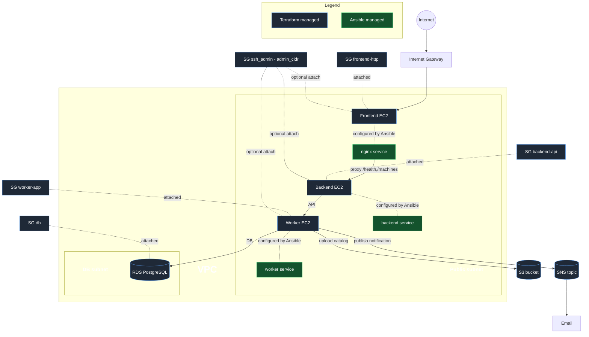

## Overview

This project provisions and deploys a 3-tier AWS application using **Terraform + Ansible**:

- **Frontend EC2**: nginx + static UI (served from S3-synced `index2.html`)
- **Backend EC2**: FastAPI validation/orchestration API
- **Worker EC2**: FastAPI persistence/integration API (RDS + S3 + SNS)

Cloud services:
- **RDS PostgreSQL** for machine persistence
- **S3** for machine catalog/object storage
- **SNS** for notifications
- **Secrets Manager** for DB password retrieval at runtime (worker)

## Short architecture explanation

The architecture is based on three EC2 instances inside one AWS VPC:

- the **frontend EC2** is the public-facing machine and runs nginx
- the **backend EC2** receives validated requests from the frontend
- the **worker EC2** performs persistence and integration tasks
- **RDS PostgreSQL** stores machine records
- **S3** stores the synchronized machine catalog file
- **SNS** sends notifications when worker-side processing completes

User traffic enters through nginx on the frontend EC2. nginx proxies API requests to the backend. The backend validates and prepares machine data, then forwards it to the worker. The worker stores the catalog in PostgreSQL, updates the JSON catalog file, uploads the file to S3, and publishes notifications through SNS.

## System components

### Terraform

- provisions AWS infrastructure (networking, IAM, EC2, RDS, S3, SNS)
- outputs runtime values consumed by Ansible
- keeps infra definition versioned and reproducible

### Ansible

- configures provisioned instances
- installs and configures nginx, app runtime, and services
- syncs Terraform outputs into inventory/group vars for deployment

### Frontend EC2

- public entry point of the application
- runs **nginx**
- serves `Ansible-modules-01/roles/frontend_content/files/index2.html` (synced from S3)
- proxies API requests such as `/health`, `/machines`, and `/schema/` to the backend

### Backend EC2

- runs the backend FastAPI service
- validates machine input
- assigns machine IDs
- exposes read and write API endpoints
- forwards machine-processing requests to the worker service

### Worker EC2

- runs the worker FastAPI service
- stores and reads machine records
- synchronizes machine data between JSON, PostgreSQL, and S3
- publishes SNS notifications
- exposes maintenance functionality such as recataloguing machine IDs

### RDS PostgreSQL

- stores machine records in the `machines` table
- acts as the authoritative persistent database when PostgreSQL mode is enabled
- is currently public so pgAdmin access can be used directly

### S3

- stores the synchronized machine catalog file
- receives uploads from the worker after machine processing and maintenance operations

### SNS

- sends notifications generated by the worker
- is connected to the email topic already used by the project

### nginx

- runs on the frontend EC2
- serves the frontend HTML page
- acts as reverse proxy between browser traffic and backend API routes

## Project structure

```text
Ansible-modules-01/
  playbooks/
  roles/
    app/files/app/src/
      frontend/
      backend/
      worker/
      shared/
terraform/
  modules/
```

Application source used by deployment lives in:

- `Ansible-modules-01/roles/app/files/app/src/backend/`
- `Ansible-modules-01/roles/app/files/app/src/worker/`
- `Ansible-modules-01/roles/app/files/app/src/frontend/`
- `Ansible-modules-01/roles/app/files/app/src/shared/`

## Architecture diagram


```mermaid
flowchart TD
    %% In-chart legend (top-left)
    subgraph Legend[Legend]
        direction TB
        Ltf[Terraform managed]
        Lans[Ansible managed]
    end

    Internet((Internet)) --> IGW[Internet Gateway]

    subgraph VPC[ ]
        direction TB

        VpcLabel[VPC]

        subgraph Net1[ ]
            direction TB
            subgraph Net1Row[ ]
                direction LR
                Front[Frontend EC2]
                Back[Backend EC2]
                Worker[Worker EC2]
                Nginx[nginx service]
                BackSvc[backend service]
                WorkerSvc[worker service]
            end
            PubLabel[Public subnet]
        end

        subgraph Net2[ ]
            direction TB
            DbLabel[DB subnet]
            RDS[(RDS PostgreSQL)]
        end
    end

    S3[(S3 bucket)]
    SNS[(SNS topic)]
    Email[Email]
    SGHttp[SG frontend-http]
    SGBack[SG backend-api]
    SGWorker[SG worker-app]
    SGDb[SG db]
    SgSsh[SG ssh_admin - admin_cidr]

    IGW --> Front
    Front -.configured by Ansible.- Nginx
    Back -.configured by Ansible.- BackSvc
    Worker -.configured by Ansible.- WorkerSvc

    Nginx -->|proxy /health,/machines| Back
    Back -->|API| Worker
    Worker -->|DB| RDS
    Worker -->|upload catalog| S3
    Worker -->|publish notification| SNS
    SNS --> Email

    SGHttp -.attached.- Front
    SGBack -.attached.- Back
    SGWorker -.attached.- Worker
    SGDb -.attached.- RDS
    SgSsh -.optional attach.- Front
    SgSsh -.optional attach.- Back
    SgSsh -.optional attach.- Worker

    classDef tf fill:#1f2937,stroke:#60a5fa,color:#fff;
    classDef ans fill:#14532d,stroke:#4ade80,color:#fff;
    classDef title fill:none,stroke:none,color:#ffffff,font-size:34px,font-weight:bold;
    classDef sublabel fill:none,stroke:none,color:#ffffff,font-size:18px,font-weight:bold;
    classDef invis fill:none,stroke:none,color:transparent;

    class Ltf,Front,Back,Worker,RDS,S3,SNS,SGHttp,SGBack,SGWorker,SGDb,SgSsh tf;
    class Lans,Nginx,BackSvc,WorkerSvc ans;
    class VpcLabel title;
    class PubLabel,DbLabel sublabel;
    class Net1Row invis;
```

## Connections between the services

The service flow is:

1. the browser reaches the **frontend EC2** over HTTP
2. **nginx** serves the static frontend page
3. nginx proxies API requests to the **backend**
4. the **backend** validates the request and forwards processing to the **worker**
5. the **worker** stores machine data in **RDS PostgreSQL**
6. the worker updates the catalog file and uploads it to **S3**
7. the worker publishes a completion notification to **SNS**
8. SNS forwards the notification to email

## Assumptions

This documentation assumes:

- you run the control-node workflow on **Linux** (Ansible/Terraform examples are Linux-first)
- Terraform `ami_id` is currently set to an Amazon Linux image in this repository's active tfvars;
  if you switch to a different distro AMI, package/service behavior may differ unless playbooks are adapted
- you have AWS credentials configured for an identity that can create IAM, EC2, VPC, RDS, S3, SNS, and Secrets Manager resources
- you can SSH into provisioned EC2 instances using the configured key pair
- your SSH private key has restrictive local permissions (for example `chmod 600 <key>.pem`) so OpenSSH/Ansible can use it
- the project is executed from this repository root with the documented directory structure unchanged

If you use macOS/Windows, the same workflow applies but package installation commands differ.

## Setup and run instructions

### Project setup in a development environment

Clone the repository and create a Python virtual environment:

```bash
git clone https://github.com/ZeR0W1/DevOpsProject1.git
cd DevOpsProject1
python -m venv venv
source venv/bin/activate  # Linux
# or: venv\Scripts\Activate  # Windows
pip install -r Ansible-modules-01/roles/app/files/app/src/backend/requirements.txt
pip install -r Ansible-modules-01/roles/app/files/app/src/worker/requirements.txt
```

Install Terraform, Ansible, and AWS CLI (example on Ubuntu/Debian):

```bash
sudo apt update
sudo apt install -y ansible awscli

# Terraform (HashiCorp repo)
wget -O- https://apt.releases.hashicorp.com/gpg | \
  gpg --dearmor | \
  sudo tee /usr/share/keyrings/hashicorp-archive-keyring.gpg >/dev/null
echo "deb [signed-by=/usr/share/keyrings/hashicorp-archive-keyring.gpg] https://apt.releases.hashicorp.com $(lsb_release -cs) main" | \
  sudo tee /etc/apt/sources.list.d/hashicorp.list
sudo apt update
sudo apt install -y terraform
```


### End-to-end deployment

Run from control node:

```bash
cd Ansible-modules-01
ANSIBLE_CONFIG=ansible.cfg ansible-playbook playbooks/site.yml
```

This orchestrates:
1. Terraform apply (`playbooks/apply_terraform.yml`)
2. Terraform→Ansible sync (`playbooks/sync_from_terraform.yml`)
3. Frontend nginx and content setup (`playbooks/install-nginx.yml`)
4. Backend/worker app deploy (`playbooks/deploy_app.yml`)

### Validation checks

After deploy:

```bash
cd terraform
FRONT_IP=$(terraform output -raw frontend_public_ip)
curl -fsS "http://$FRONT_IP/health"
curl -fsS "http://$FRONT_IP/machines"
```

### systemd services

The deployed EC2 instances use systemd units for the backend and worker services, and nginx as the frontend web server.

## Use of nginx, RDS, S3, and SNS in the application

### nginx

- hosts the frontend HTML page
- exposes the public application endpoint
- proxies browser API traffic to the backend

### RDS

- stores machine records in PostgreSQL
- is used by the worker for persistent machine storage
- currently remains public to allow direct pgAdmin access

### S3

- stores the synchronized `instances.json` catalog copy
- receives uploads from the worker after processing or recataloguing

### SNS

- sends application notifications from the worker
- is used to notify by email when worker-side operations complete

## Deployment notes

- Frontend source file for S3 sync (editable copy in repo):
  - `Ansible-modules-01/roles/frontend_content/files/index2.html`
- Backend code:
  - `Ansible-modules-01/roles/app/files/app/src/backend/`
- Worker code:
  - `Ansible-modules-01/roles/app/files/app/src/worker/`
- Active EC2 security groups:
  - Front: `http`
  - Back: `backend-api`
  - Worker: `worker-app`
- Active security-group flow:
  - `http` allows inbound `80/tcp` from the internet
  - `backend-api` allows inbound `8000/tcp` from SG `http`
  - `worker-app` allows inbound `8000/tcp` from SG `backend-api`
  - RDS SG `default` allows `5432/tcp` from SG `worker-app` and from the admin IP used for pgAdmin access

## Security decisions rationale

- `0.0.0.0/0` is used for `80/tcp` only on the public frontend to expose HTTP.
- `admin_cidr` is defined in Terraform input/secrets flow and then used by the networking module (`terraform/modules/networking`) to configure the `ssh_admin` security group.
- `ssh_admin` is a Terraform-created security group in `terraform/modules/networking/main.tf`, attached to app instances when `enable_ssh_ingress=true`.
- App-to-app communication is restricted to the relevant security groups (`frontend -> backend -> worker`).
- RDS ingress is restricted to worker security group + admin CIDR (for direct DB access when needed).

## Runtime/secrets model

- Worker reads DB password from **AWS Secrets Manager** using:
  - `POSTGRES_PASSWORD_SECRET_NAME`
  - `AWS_REGION`
- DB password is not hardcoded into generated Ansible app environment files.

## Vault vs AWS Secrets Manager

Both are used, but for different scopes:

- **Ansible Vault (`Ansible-modules-01/vault/staging.yml`)**
  - stores control-node/deployment inputs (for example SSH key path and deployment-time values)
  - is consumed by Ansible playbooks during orchestration

- **AWS Secrets Manager**
  - stores runtime cloud secret values (notably DB password)
  - is accessed by the worker service at runtime via IAM permissions
  - avoids embedding DB password directly in generated app env files

## Terraform state management

- State is currently managed as **local state** under `terraform/terraform.tfstate`.
- This is acceptable for coursework/demo workflows on a single control node.
- For team/production use, migrate state to a remote backend (for locking/history/access control).


## Destroy / teardown

```bash
cd terraform
terraform destroy
```

If the bucket is intentionally retained (to keep frontend content), `terraform destroy` may stop at S3 with `BucketNotEmpty`.

If using a non-default variable file:

```bash
terraform destroy -var-file=terraform.fresh.tfvars
```

## Service documentation

- Terraform docs: [terraform/README.md](terraform/README.md)
- Ansible docs: [Ansible-modules-01/README.md](Ansible-modules-01/README.md)
- Frontend: [Ansible-modules-01/roles/app/files/app/src/frontend/README.md](Ansible-modules-01/roles/app/files/app/src/frontend/README.md)
- Backend: [Ansible-modules-01/roles/app/files/app/src/backend/README.md](Ansible-modules-01/roles/app/files/app/src/backend/README.md)
- Worker: [Ansible-modules-01/roles/app/files/app/src/worker/README.md](Ansible-modules-01/roles/app/files/app/src/worker/README.md)

## Known issues

### pip self-update under Ansible become(root)

- In this project, `buluma.python_pip` is executed from `playbooks/deploy_app.yml` with:
  - `python_pip_update: false`
- This is intentional for stability on the current Amazon Linux-based target hosts.

Observed behavior:
- Enabling pip self-update has previously failed with errors indicating missing Python module context (for example `packaging`) when tasks run under `become: true`.
- The failure is caused by interpreter/site-package context mismatch during root-executed pip operations.

Current workaround:
- Keep `python_pip_update: false` in deploy playbooks.
- `buluma.python_pip` still installs pip packages with `state: present`, so hosts without pip are bootstrapped.
- Continue installing app dependencies in the application virtual environment (`app` role), which remains the supported deployment path.

If pip self-update must be re-enabled in future:
- ensure required Python tooling is present in the exact interpreter context used by Ansible pip tasks, and
- test on the same Amazon Linux image family used by Terraform before changing defaults.

Notes:
- `sync_from_terraform.yml` refreshes generated files (`inventory.ini`, `group_vars`) and also refreshes in-memory host vars for `Front`, `Back`, and `Worker` in the same run.
- To reuse an existing S3 bucket without attempting bucket creation during apply, set `create_s3_bucket = false` and keep `bucket_name` set to that existing bucket.