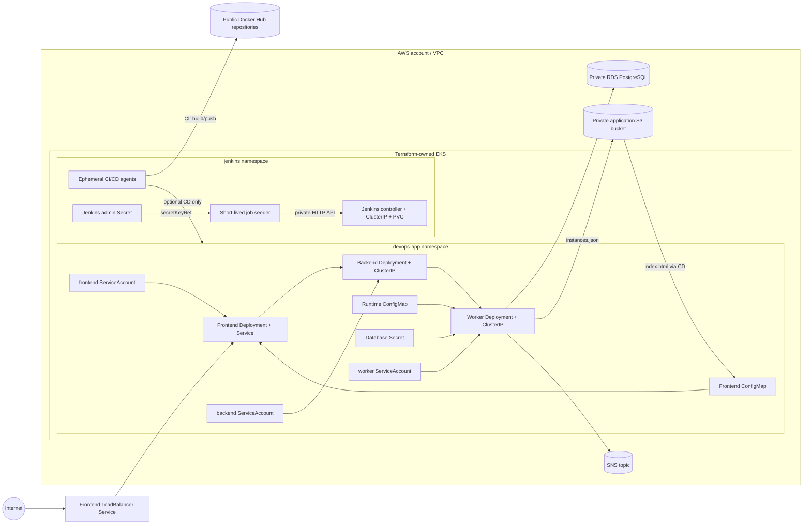

# DevOps on AWS: Kubernetes, EKS, and Jenkins

> **Repository status: deployed and integration-validated — documentation and
> hand-in evidence remain in progress.**
>
> The Terraform-owned target stack and Jenkins delivery path have been verified
> live. The new professor-facing setup/create/destroy wrappers are locally
> validated but have not themselves been used to recreate or destroy the stack.

## Project goal

The assignment target is a three-service application on Amazon EKS:

- **frontend** — nginx-hosted browser UI and the only generally public
  application entry point;
- **backend** — internal FastAPI validation/orchestration service;
- **worker** — internal FastAPI persistence and integration service;
- **RDS PostgreSQL** — primary structured datastore;
- **S3** — initial `index.html` content and synchronized `instances.json` backup;
- **SNS** — application notifications; and
- **Jenkins** — mandatory CI with a separately controlled optional CD job.

The remaining work is tracked in
[`HANDIN_READINESS_CHECKLIST.md`](HANDIN_READINESS_CHECKLIST.md). The durable
safety and recovery record is
[`.clinerules/90-current-project-status.md`](.clinerules/90-current-project-status.md).

## Ownership and lifecycle boundaries

- **Terraform owns AWS infrastructure**: VPC networking, EKS, RDS, S3, SNS,
  Secrets Manager, and AWS identity integrations.
- **Ansible is the routine lifecycle orchestrator**. The guarded create flow is
  implemented through the reviewed `create.yml` wrapper; lower-level stages stay
  composable and default-off when invoked independently.
- **Jenkins CI and CD remain separate**. `Jenkins/Jenkinsfile.eks` checks code and
  charts and builds one immutable tag for all three images. CD through
  `Jenkins/Jenkinsfile-deploy` is optional and is the only Jenkins job allowed to
  change application workloads. CI may seed or explicitly reset the versioned S3
  `index.html`; CD is the sole owner of the S3-to-Kubernetes content activation.
- **Helm deploys three independent releases** from `helm/frontend`,
  `helm/backend`, and `helm/worker`. The retained `helm/spring-music` chart is the
  professor-provided reference/template; it is not the production application
  release.

## Target architecture


```mermaid
flowchart LR
    Internet((Internet)) --> FrontEntry[Frontend LoadBalancer Service]

    subgraph AWS[AWS account / VPC]
      subgraph EKS[Terraform-owned EKS]
        subgraph AppNS[devops-app namespace]
          Front[Frontend Deployment + Service]
          Back[Backend Deployment + ClusterIP]
          Worker[Worker Deployment + ClusterIP]
          FrontCM[Frontend ConfigMap]
          RuntimeCM[Runtime ConfigMap]
          DbSecret[Database Secret]
          FrontSA[frontend ServiceAccount]
          BackSA[backend ServiceAccount]
          WorkerSA[worker ServiceAccount]
        end

        subgraph JenkinsNS[jenkins namespace]
          Jenkins[Jenkins controller + ClusterIP + PVC]
          Agents[Ephemeral CI/CD agents]
          Seeder[Short-lived job seeder]
          AdminSecret[Jenkins admin Secret]
        end
      end

      RDS[(Private RDS PostgreSQL)]
      Bucket[(Private application S3 bucket)]
      Topic[(SNS topic)]
    end

    FrontEntry --> Front
    Front --> Back
    Back --> Worker
    Worker --> RDS
    Worker -->|instances.json| Bucket
    Bucket -->|index.html via CD| FrontCM
    Worker --> Topic
    FrontCM --> Front
    RuntimeCM --> Worker
    DbSecret --> Worker
    FrontSA --> Front
    BackSA --> Back
    WorkerSA --> Worker
    Agents -->|CI: build/push| Registry[(Public Docker Hub repositories)]
    Agents -->|optional CD only| AppNS
    AdminSecret -->|secretKeyRef| Seeder
    Seeder -->|private HTTP API| Jenkins
```

Target Kubernetes invariants include two replicas per service, readiness/liveness
probes, resource requests/limits, non-root least-privilege security contexts,
separate ServiceAccounts, an internal backend and worker, and a private RDS/S3/SNS
trust boundary.

## Repository map

| Path | Purpose |
| --- | --- |
| `terraform/` | Main AWS stack; partial S3 backend configuration |
| `terraform/state-bootstrap/` | Separate retained Terraform-state bucket root |
| `setup.sh` | One-time pinned local tool and private-input setup |
| `Ansible-modules-01/playbooks/create.yml` | Professor-facing complete create lifecycle |
| `Ansible-modules-01/playbooks/site.yml` | Composable internal lifecycle orchestrator |
| `Ansible-modules-01/playbooks/destroy.yml` | Separate guarded destroy entry point |
| `Jenkins/Jenkinsfile.eks` | Mandatory EKS-native CI pipeline |
| `Jenkins/Jenkinsfile-deploy` | Optional standalone CD pipeline |
| `helm/frontend`, `helm/backend`, `helm/worker` | Independent application charts |
| `helm/spring-music` | Professor-provided Helm reference/template |
| `Ansible-modules-01/roles/app/files/app/src/` | Application source |
| `scripts/legacy/`, `Jenkins/legacy/` | Archived transitional/lab assets; not supported lifecycle owners |

The repository default frontend source is
`Ansible-modules-01/roles/app/files/app/src/frontend/index.html`. The authoritative
runtime source is the Terraform-owned, versioned S3 object `index.html`.

## Jenkins model

The CI pipeline is mandatory. It performs checkout, Python compilation/testing,
Dockerfile checks, Helm lint/render checks, image builds with Kaniko, and pushes
frontend/backend/worker images under one immutable tag. Trivy scanning is a
selected bonus and remains optional while inherited-vulnerability policy is
finalized.

Successful CI does **not** require automatic deployment. CD is controlled by
`DEPLOY_TO_EKS` and a separate job. This preserves the security boundary that only
the deployer job receives namespace-scoped Kubernetes mutation permissions.

The frontend Kubernetes `LoadBalancer` Service is the only public application
endpoint. Jenkins remains ClusterIP-only with no Ingress or public load balancer.
Ansible seeds CD before CI from a hardened short-lived in-cluster Job that reads
the official chart admin Secret through `secretKeyRef`; credentials are not sent
to the control node. When interactive UI access is needed, an operator can use:

```bash
kubectl --kubeconfig Ansible-modules-01/recovery/target-kubeconfig \
  -n jenkins port-forward svc/jenkins 18080:8080
```

### Frontend runtime content

CI validates the repository default and uses `FRONTEND_CONTENT_BUCKET` plus the
fixed `FRONTEND_CONTENT_KEY=index.html`. A missing object is seeded. An existing
object is preserved unless `OVERWRITE_FRONTEND_CONTENT=true`, which provides an
explicit reset to the repository default. S3 versioning preserves earlier object
versions for rollback.

The standalone CD pipeline supports:

- `FULL`: synchronize S3 content, deploy all three immutable image releases with
  Helm, verify them, then restart only the frontend to activate the content; and
- `CONTENT_ONLY`: skip all Helm/image changes, synchronize the CD-owned
  `frontend-runtime-content` ConfigMap, verify its SHA-256, and perform a rolling
  restart of only the frontend Deployment.

`helm/frontend` references this external ConfigMap and mounts it read-only at
`/usr/share/nginx/html`; backend and worker do not receive the content. The
reviewed `scripts/manage_frontend_content.sh` helper contains only reusable
validation/S3/ConfigMap mechanics. Jenkinsfiles retain explicit orchestration
stages, while Ansible remains responsible for the wider platform lifecycle and
future idempotent job-seeding invocation. This avoids adding an Ansible runtime
and collections to every ephemeral content-only CD agent.

AWS access uses separate EKS Pod Identity roles: CI receives `GetObject` and
`PutObject` only for `index.html`; CD receives `GetObject` for that object plus
`eks:DescribeCluster`. Kubernetes mutation remains namespace-scoped through the
`jenkins-deployer` Role and EKS access entry; no `pods/exec` permission is needed.

Public custom Jenkins images are reproducible from:

- `Jenkins/Dockerfile.controller` + `Jenkins/plugins.txt`;
- `Jenkins/Dockerfile.agent` for Python/check tooling; and
- `Jenkins/Dockerfile.kaniko-agent` for the documented Kaniko compatibility
  image.

Users can pull public images without the repository owner's Docker Hub
credentials. Credentials are needed only to publish replacement images.

## Setup, create, and destroy

The supported lifecycle uses project-local pinned tools. From the repository root:

```bash
./setup.sh
source .venv/bin/activate
cd Ansible-modules-01
ansible-playbook -i localhost, --connection=local playbooks/create.yml
```

`setup.sh` installs pinned Python/controller dependencies, Terraform, kubectl,
Helm, and Ansible collections under the repository. It then creates or retains an
ignored mode-`0600` `.vault-password` and prompts for the local environment
values stored as individually Ansible-Vault-encrypted entries in the ignored
mode-`0600` `vault/local-environment.yml`.

`create.yml` prompts for `DEPLOY_DEFAULT` or `BUILD_AND_DEPLOY`, derives the AWS
account/region resource scope, rejects an unowned remote-state bucket collision,
and displays the billable boundary before requiring one exact typed confirmation.
Default delivery uses promoted public images and needs no Docker Hub credential.
Build delivery prompts for a Docker Hub owner/token only when they are absent,
verifies them, and adds an idempotent encrypted block to the same local environment
file. The token is never committed or printed.

The destroy lifecycle remains default-off. A harmless inspection run is:

```bash
ansible-playbook -i localhost, --connection=local playbooks/destroy.yml
```

To deliberately enable teardown, set `DESTROY_EXECUTE=true`; optionally set
`RETAIN_APPLICATION_DATA=true` to copy `index.html` and `instances.json` into the
ignored private recovery directory first. The enabled path verifies Terraform
ownership and the explicit project kubeconfig, displays the exact scope, and asks
for the cluster/bucket confirmation before removing Kubernetes/Jenkins state and
running one Terraform destroy. The separate remote-state bucket is retained.

## Safe local validation

The following commands are intended for local/static validation. They do not
authorize a Terraform plan/apply, backend initialization, cloud mutation, secret
sync, or enabled destroy:

```bash
terraform -chdir=terraform fmt -check -recursive
terraform -chdir=terraform validate
terraform -chdir=terraform/state-bootstrap fmt -check
terraform -chdir=terraform/state-bootstrap validate

ANSIBLE_CONFIG=Ansible-modules-01/ansible.cfg \
  .venv/bin/ansible-playbook -i localhost, --connection=local \
  --syntax-check Ansible-modules-01/playbooks/create.yml
ANSIBLE_CONFIG=Ansible-modules-01/ansible.cfg \
  .venv/bin/ansible-playbook -i localhost, --connection=local \
  --syntax-check Ansible-modules-01/playbooks/destroy.yml

helm lint helm/frontend
helm lint helm/backend
helm lint helm/worker
helm template frontend helm/frontend --namespace devops-app >/dev/null
helm template backend helm/backend --namespace devops-app >/dev/null
helm template worker helm/worker --namespace devops-app >/dev/null
```

See [`terraform/README.md`](terraform/README.md) and
[`Ansible-modules-01/README.md`](Ansible-modules-01/README.md) before running any
lifecycle stage.

## Create and destroy status

`Ansible-modules-01/playbooks/create.yml` is the supported complete entry point;
`site.yml` remains its composable internal orchestrator for local input
preparation, Terraform lifecycle, EKS/Jenkins platform preparation,
non-secret runtime preparation, in-cluster Jenkins job seeding, database Secret
synchronization, and an in-cluster CI queue handoff. CI then owns immutable image
publication and seed-if-missing `index.html`; delivery hands off to the separate
FULL CD job. Manual invocation plus its typed scope prompt authorize that
documented lifecycle; automation agents still require explicit user approval
before invoking it.

`Ansible-modules-01/playbooks/destroy.yml` is a separate dependency-ordered
workflow. Its default invocation performs only local assertions/debug. The enabled
path requires `DESTROY_EXECUTE=true`, project-local tools/kubeconfig, Terraform
ownership checks, exact cluster/bucket confirmation, and a reviewed state boundary
before it can remove application
releases, Jenkins data, the application bucket contents, or the main stack. The
Terraform state bucket remains retained by default.

## Protected external resources

- Preserve legacy bucket `quick-demo-058264247987-us-east-1-an`. It is not part of
  the new Terraform state and must not be altered or silently adopted.
- Preserve termination-protected stack `eksctl-learn-eks-cluster` during the
  current phase.
- The transitional live `devops-app-eks` cluster was created through
  eksctl/CloudFormation and is not owned by the empty Terraform state. The future
  Terraform cluster must use a distinct name.

## Current limitations

- The setup/create/destroy wrappers are locally validated but have not been used
  for a full fresh-account create or an enabled teardown.
- PostgreSQL currently uses TLS `require`; packaging the AWS RDS CA bundle for
  `verify-full` remains future hardening.
- The promoted Jenkins fallback should be reseeded before a later delivery run.
- Assignment-complete evidence and the final architecture/security narrative are
  still pending.

Historical scripts are retained only for provenance under `scripts/legacy/` and
`Jenkins/legacy/`. Do not use them as an alternative infrastructure or deployment
owner.

## Detailed documentation

- [Hand-in readiness checklist](HANDIN_READINESS_CHECKLIST.md)
- [Terraform guide](terraform/README.md)
- [Ansible guide](Ansible-modules-01/README.md)
- [Frontend service](Ansible-modules-01/roles/app/files/app/src/frontend/README.md)
- [Backend service](Ansible-modules-01/roles/app/files/app/src/backend/README.md)
- [Worker service](Ansible-modules-01/roles/app/files/app/src/worker/README.md)
