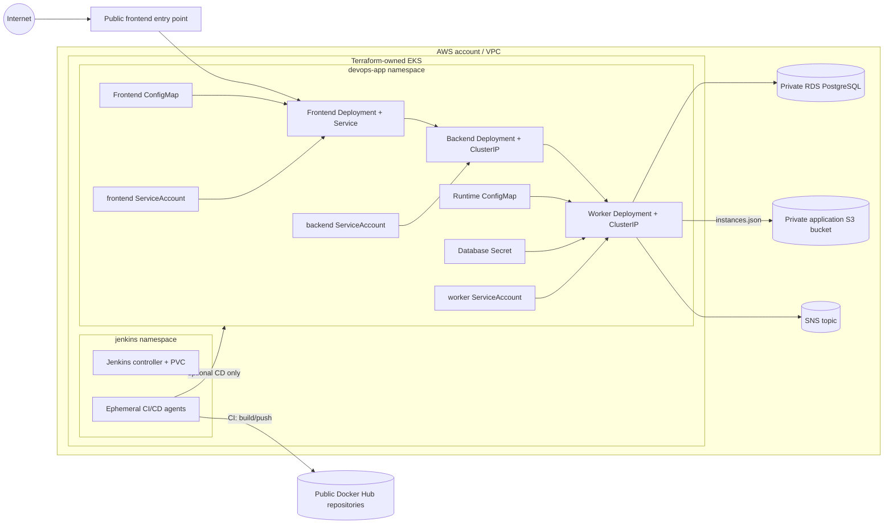

# DevOps on AWS: Kubernetes, EKS, and Jenkins

> **Repository status: mid-refactor — not hand-in ready.**
>
> The target Terraform-owned, Ansible-orchestrated EKS lifecycle has not been
> created or verified end to end. Current validation is local/static unless a
> dated evidence section says otherwise. Do not run mutation stages without
> reviewing the safety gates and current ownership boundary.

## Project goal

The assignment target is a three-service application on Amazon EKS:

- **frontend** — nginx-hosted browser UI and the only generally public
  application entry point;
- **backend** — internal FastAPI validation/orchestration service;
- **worker** — internal FastAPI persistence and integration service;
- **RDS PostgreSQL** — primary structured datastore;
- **S3** — initial `index.html` content and synchronized `instances.json` backup;
- **SNS** — application notifications; and
- **Jenkins** — mandatory CI with a separately controlled optional CD job.

The remaining work is tracked in
[`HANDIN_READINESS_CHECKLIST.md`](HANDIN_READINESS_CHECKLIST.md). The durable
safety and recovery record is
[`.clinerules/90-current-project-status.md`](.clinerules/90-current-project-status.md).

## Ownership and lifecycle boundaries

- **Terraform owns AWS infrastructure**: VPC networking, EKS, RDS, S3, SNS,
  Secrets Manager, and AWS identity integrations.
- **Ansible is the routine lifecycle orchestrator**. The guarded create flow is
  still incomplete; default execution performs local checks and leaves mutations
  disabled.
- **Jenkins CI and CD remain separate**. `Jenkins/Jenkinsfile.eks` checks code and
  charts and builds one immutable tag for all three images. CD through
  `Jenkins/Jenkinsfile-deploy` is optional and is the only Jenkins job allowed to
  change application workloads.
- **Helm deploys three independent releases** from `helm/frontend`,
  `helm/backend`, and `helm/worker`. The retained `helm/spring-music` chart is the
  professor-provided reference/template; it is not the production application
  release.

## Target architecture


```mermaid
flowchart LR
    Internet((Internet)) --> FrontEntry[Public frontend entry point]

    subgraph AWS[AWS account / VPC]
      subgraph EKS[Terraform-owned EKS]
        subgraph AppNS[devops-app namespace]
          Front[Frontend Deployment + Service]
          Back[Backend Deployment + ClusterIP]
          Worker[Worker Deployment + ClusterIP]
          FrontCM[Frontend ConfigMap]
          RuntimeCM[Runtime ConfigMap]
          DbSecret[Database Secret]
          FrontSA[frontend ServiceAccount]
          BackSA[backend ServiceAccount]
          WorkerSA[worker ServiceAccount]
        end

        subgraph JenkinsNS[jenkins namespace]
          Jenkins[Jenkins controller + PVC]
          Agents[Ephemeral CI/CD agents]
        end
      end

      RDS[(Private RDS PostgreSQL)]
      Bucket[(Private application S3 bucket)]
      Topic[(SNS topic)]
    end

    FrontEntry --> Front
    Front --> Back
    Back --> Worker
    Worker --> RDS
    Worker -->|instances.json| Bucket
    Worker --> Topic
    FrontCM --> Front
    RuntimeCM --> Worker
    DbSecret --> Worker
    FrontSA --> Front
    BackSA --> Back
    WorkerSA --> Worker
    Agents -->|CI: build/push| Registry[(Public Docker Hub repositories)]
    Agents -->|optional CD only| AppNS
```

Target Kubernetes invariants include two replicas per service, readiness/liveness
probes, resource requests/limits, non-root least-privilege security contexts,
separate ServiceAccounts, an internal backend and worker, and a private RDS/S3/SNS
trust boundary.

## Repository map

| Path | Purpose |
| --- | --- |
| `terraform/` | Main AWS stack; partial S3 backend configuration |
| `terraform/state-bootstrap/` | Separate retained Terraform-state bucket root |
| `Ansible-modules-01/playbooks/site.yml` | Guarded create entry point; incomplete |
| `Ansible-modules-01/playbooks/destroy.yml` | Separate guarded destroy entry point |
| `Jenkins/Jenkinsfile.eks` | Mandatory EKS-native CI pipeline |
| `Jenkins/Jenkinsfile-deploy` | Optional standalone CD pipeline |
| `helm/frontend`, `helm/backend`, `helm/worker` | Independent application charts |
| `helm/spring-music` | Professor-provided Helm reference/template |
| `Ansible-modules-01/roles/app/files/app/src/` | Application source |
| `scripts/legacy/`, `Jenkins/legacy/` | Archived transitional/lab assets; not supported lifecycle owners |

The canonical frontend source is
`Ansible-modules-01/roles/app/files/app/src/frontend/index.html`.

## Jenkins model

The CI pipeline is mandatory. It performs checkout, Python compilation/testing,
Dockerfile checks, Helm lint/render checks, image builds with Kaniko, and pushes
frontend/backend/worker images under one immutable tag. Trivy scanning is a
selected bonus and remains optional while inherited-vulnerability policy is
finalized.

Successful CI does **not** require automatic deployment. CD is controlled by
`AUTO_DEPLOY` and a separate job. This preserves the security boundary that only
the deployer job receives namespace-scoped Kubernetes mutation permissions.

Public custom Jenkins images are reproducible from:

- `Jenkins/Dockerfile.controller` + `Jenkins/plugins.txt`;
- `Jenkins/Dockerfile.agent` for Python/check tooling; and
- `Jenkins/Dockerfile.kaniko-agent` for the documented Kaniko compatibility
  image.

Users can pull public images without the repository owner's Docker Hub
credentials. Credentials are needed only to publish replacement images.

## Safe local validation

The following commands are intended for local/static validation. They do not
authorize a Terraform plan/apply, backend initialization, cloud mutation, secret
sync, or enabled destroy:

```bash
terraform -chdir=terraform fmt -check -recursive
terraform -chdir=terraform validate
terraform -chdir=terraform/state-bootstrap fmt -check
terraform -chdir=terraform/state-bootstrap validate

ANSIBLE_CONFIG=Ansible-modules-01/ansible.cfg \
  ansible-playbook --syntax-check Ansible-modules-01/playbooks/site.yml
ANSIBLE_CONFIG=Ansible-modules-01/ansible.cfg \
  ansible-playbook --syntax-check Ansible-modules-01/playbooks/destroy.yml

helm lint helm/frontend
helm lint helm/backend
helm lint helm/worker
helm template frontend helm/frontend --namespace devops-app >/dev/null
helm template backend helm/backend --namespace devops-app >/dev/null
helm template worker helm/worker --namespace devops-app >/dev/null
```

See [`terraform/README.md`](terraform/README.md) and
[`Ansible-modules-01/README.md`](Ansible-modules-01/README.md) before running any
lifecycle stage.

## Create and destroy status

`Ansible-modules-01/playbooks/site.yml` currently orchestrates guarded local input
preparation, Terraform lifecycle gates, and application-secret preparation. The
remaining cluster prerequisites, Jenkins Helm/RBAC/job seeding, initial S3
content, runtime configuration, and standalone CD invocation are not complete.

`Ansible-modules-01/playbooks/destroy.yml` is a separate dependency-ordered
workflow. Its default invocation performs only local assertions/debug. The enabled
path requires explicit flags, Terraform ownership checks, exact cluster/bucket
confirmation, and a reviewed state boundary before it can remove application
releases, Jenkins data, the application bucket contents, or the main stack. The
Terraform state bucket remains retained by default.

## Protected external resources

- Preserve legacy bucket `quick-demo-058264247987-us-east-1-an`. It is not part of
  the new Terraform state and must not be altered or silently adopted.
- Preserve termination-protected stack `eksctl-learn-eks-cluster` during the
  current phase.
- The transitional live `devops-app-eks` cluster was created through
  eksctl/CloudFormation and is not owned by the empty Terraform state. The future
  Terraform cluster must use a distinct name.

## Current limitations

- PostgreSQL/S3/SNS worker behavior and automated tests are still incomplete.
- The final public frontend route and controlled Jenkins administrative access
  still need implementation/verification.
- The Ansible create flow and Jenkins deployment/job-seeding lifecycle are not
  complete.
- Assignment-complete evidence and the final architecture/security narrative are
  still pending.

Historical scripts are retained only for provenance under `scripts/legacy/` and
`Jenkins/legacy/`. Do not use them as an alternative infrastructure or deployment
owner.

## Detailed documentation

- [Hand-in readiness checklist](HANDIN_READINESS_CHECKLIST.md)
- [Terraform guide](terraform/README.md)
- [Ansible guide](Ansible-modules-01/README.md)
- [Frontend service](Ansible-modules-01/roles/app/files/app/src/frontend/README.md)
- [Backend service](Ansible-modules-01/roles/app/files/app/src/backend/README.md)
- [Worker service](Ansible-modules-01/roles/app/files/app/src/worker/README.md)
