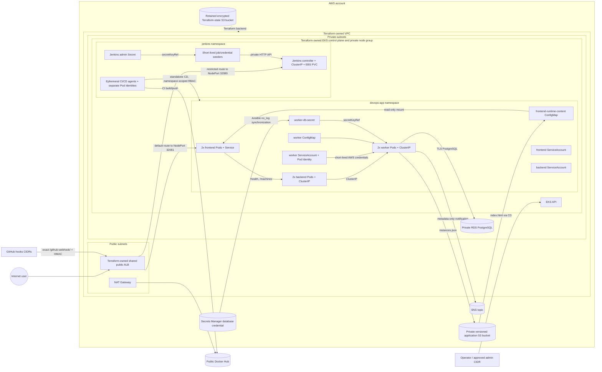
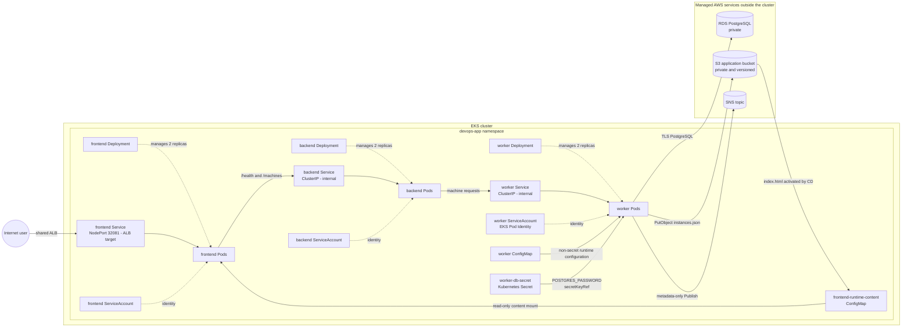

# DevOps on AWS: Kubernetes, EKS, and Jenkins


## Project goal

This project runs a three-service application on Amazon EKS:

- **frontend** — nginx-hosted browser UI and the only generally public
  application entry point;
- **backend** — internal FastAPI validation/orchestration service;
- **worker** — internal FastAPI persistence and integration service;
- **RDS PostgreSQL** — primary structured datastore;
- **S3** — initial `index.html` content and synchronized `instances.json` backup;
- **SNS** — application notifications; and
- **Jenkins** — mandatory CI with a separately controlled optional CD job.

## Ownership and lifecycle boundaries

- **Terraform owns AWS infrastructure**: VPC networking, EKS, RDS, S3, SNS,
  Secrets Manager, and AWS identity integrations.
- **Ansible is the routine lifecycle orchestrator**. The guarded create flow is
  implemented through the reviewed `create.yml` wrapper; lower-level stages stay
  composable and default-off when invoked independently.
- **Jenkins CI and CD remain separate**. `Jenkins/Jenkinsfile.eks` checks code and
  charts and builds one immutable tag for all three images. CD through
  `Jenkins/Jenkinsfile-deploy` is optional and is the only Jenkins job allowed to
  change application workloads. CI may seed or explicitly reset the versioned S3
  `index.html`; CD is the sole owner of the S3-to-Kubernetes content activation.
- **Helm deploys three independent releases** from `helm/frontend`,
  `helm/backend`, and `helm/worker`.

## Target architecture


```mermaid
flowchart LR
    User((Internet user)) --> ALB[Terraform-owned shared public ALB]
    GitHub[GitHub hooks CIDRs] -->|exact /github-webhook/ + HMAC| ALB
    Operator[Operator / approved admin CIDR] --> EKSAPI[EKS API]
    Registry[(Public Docker Hub)]

    subgraph AWS[AWS account]
      State[(Retained encrypted Terraform-state S3 bucket)]

      subgraph VPC[Terraform-owned VPC]
        subgraph Public[Public subnets]
          ALB
          NAT[NAT Gateway]
        end

        subgraph Private[Private subnets]
          subgraph EKS[Terraform-owned EKS control plane and private node group]
            EKSAPI
            subgraph AppNS[devops-app namespace]
              Front[2x frontend Pods + Service]
              Back[2x backend Pods + ClusterIP]
              Worker[2x worker Pods + ClusterIP]
              FrontCM[frontend-runtime-content ConfigMap]
              RuntimeCM[worker ConfigMap]
              DbSecret[worker-db-secret]
              FrontSA[frontend ServiceAccount]
              BackSA[backend ServiceAccount]
              WorkerSA[worker ServiceAccount + Pod Identity]
            end

            subgraph JenkinsNS[jenkins namespace]
              Jenkins[Jenkins controller + ClusterIP + EBS PVC]
              Agents[Ephemeral CI/CD agents + separate Pod Identities]
              Seeder[Short-lived job/credential seeders]
              AdminSecret[Jenkins admin Secret]
            end
          end

          RDS[(Private RDS PostgreSQL)]
        end
      end

      Bucket[(Private versioned application S3 bucket)]
      Topic[(SNS topic)]
      Secrets[(Secrets Manager database credential)]
    end

    ALB -->|default route to NodePort 32081| Front
    ALB -->|restricted route to NodePort 32080| Jenkins
    Front -->|/health, /machines| Back
    Back -->|ClusterIP| Worker
    Worker -->|TLS PostgreSQL| RDS
    WorkerSA -->|short-lived AWS credentials| Worker
    Worker -->|instances.json| Bucket
    Worker -->|metadata-only notification| Topic
    Bucket -->|index.html via CD| FrontCM
    FrontCM -->|read-only mount| Front
    RuntimeCM --> Worker
    Secrets -->|Ansible no_log synchronization| DbSecret
    DbSecret -->|secretKeyRef| Worker
    NAT --> Registry
    Agents -->|CI build/push| Registry
    Agents -->|standalone CD, namespace-scoped RBAC| AppNS
    AdminSecret -->|secretKeyRef| Seeder
    Seeder -->|private HTTP API| Jenkins
    State -. Terraform backend .-> VPC
```

Target Kubernetes invariants include two replicas per service, readiness/liveness
probes, resource requests/limits, non-root least-privilege security contexts,
separate ServiceAccounts, an internal backend and worker, and a private RDS/S3/SNS
trust boundary.

### Kubernetes application architecture

This focused view shows the application resources inside `devops-app` and their
connections to managed services outside the cluster. The Terraform-owned shared
ALB targets the frontend's fixed NodePort; no Kubernetes Ingress owns an AWS load
balancer.


```mermaid
flowchart LR
    User((Internet user))

    subgraph EKS[EKS cluster]
      subgraph AppNS[devops-app namespace]
        FrontSvc[frontend Service<br/>NodePort 32081 - ALB target]
        FrontDeploy[frontend Deployment] -. manages 2 replicas .-> FrontPods[frontend Pods]
        FrontSvc --> FrontPods
        FrontSA[frontend ServiceAccount] -. identity .-> FrontPods
        FrontCM[frontend-runtime-content<br/>ConfigMap] -->|read-only content mount| FrontPods

        FrontPods -->|/health and /machines| BackSvc[backend Service<br/>ClusterIP - internal]
        BackDeploy[backend Deployment] -. manages 2 replicas .-> BackPods[backend Pods]
        BackSvc --> BackPods
        BackSA[backend ServiceAccount] -. identity .-> BackPods

        BackPods -->|machine requests| WorkerSvc[worker Service<br/>ClusterIP - internal]
        WorkerDeploy[worker Deployment] -. manages 2 replicas .-> WorkerPods[worker Pods]
        WorkerSvc --> WorkerPods
        WorkerSA[worker ServiceAccount<br/>EKS Pod Identity] -. identity .-> WorkerPods
        WorkerCM[worker ConfigMap] -->|non-secret runtime configuration| WorkerPods
        DbSecret[worker-db-secret<br/>Kubernetes Secret] -->|POSTGRES_PASSWORD<br/>secretKeyRef| WorkerPods
      end
    end

    subgraph External[Managed AWS services outside the cluster]
      RDS[(RDS PostgreSQL<br/>private)]
      Bucket[(S3 application bucket<br/>private and versioned)]
      Topic[(SNS topic)]
    end

    User -->|shared ALB| FrontSvc
    WorkerPods -->|TLS PostgreSQL| RDS
    WorkerPods -->|PutObject instances.json| Bucket
    WorkerPods -->|metadata-only Publish| Topic
    Bucket -->|index.html activated by CD| FrontCM
```

All three Deployments use readiness and liveness probes, resource requests and
limits, immutable image tags, and non-root least-privilege container security
contexts. Only `worker-sa` receives application AWS permissions; its Pod Identity
role is restricted to the required `instances.json` S3 object and SNS topic.

## Repository map

| Path | Purpose |
| --- | --- |
| `terraform/` | Main AWS stack; partial S3 backend configuration |
| `terraform/state-bootstrap/` | Separate retained Terraform-state bucket root |
| `setup.sh` | One-time pinned local tool and private-input setup |
| `Ansible-modules-01/playbooks/create.yml` | Complete guarded create lifecycle |
| `Ansible-modules-01/playbooks/create/` | Internal create stages and ordered lifecycle |
| `Ansible-modules-01/playbooks/create/setup/` | Operator-invoked local setup and CIDR maintenance helpers |
| `Ansible-modules-01/playbooks/destroy.yml` | Guarded normal/resume destroy entry point |
| `Ansible-modules-01/playbooks/destroy/` | Internal destroy stages and ordered lifecycle |
| `Jenkins/Jenkinsfile.eks` | Mandatory EKS-native CI pipeline |
| `Jenkins/Jenkinsfile-deploy` | Optional standalone CD pipeline |
| `helm/frontend`, `helm/backend`, `helm/worker` | Independent application charts |
| `app/src/` | Application source |

The repository default frontend source is
`app/src/frontend/index.html`. The authoritative
runtime source is the Terraform-owned, versioned S3 object `index.html`.

## Jenkins model

The CI pipeline performs checkout, Python testing with published JUnit results,
Bandit and flake8 checks, mandatory HIGH/CRITICAL Trivy scanning for source-build
runs, Helm lint/render checks, and Kaniko builds without a Docker socket. It
pushes frontend/backend/worker images under one immutable tag and records each
registry digest.

Successful CI does **not** require automatic deployment. CD is controlled by
`DEPLOY_TO_EKS` and a separate job. This preserves the security boundary that only
the deployer job receives namespace-scoped Kubernetes mutation permissions.

The Terraform-owned shared ALB is the only public entry point. Its default route
serves the frontend through fixed NodePort `32081`; only the exact
`/github-webhook/` path from GitHub's current IPv4 `hooks` CIDRs reaches the
dedicated Jenkins webhook NodePort `32080`. All other Jenkins paths fall through
to the frontend, and the normal Jenkins Service remains ClusterIP-only. GitHub
HMAC validation is required before the SCM-backed CI job runs; CD stays separate
and manual unless CI is explicitly configured to trigger it. CD archives the CI
job/build URL, commit, image tag, and available image digests, plus best-effort
logs/events on failure. Ansible seeds CD before CI from a hardened short-lived
in-cluster Job; credentials are not sent to the control node. For interactive UI
access, use a short-lived operator port-forward:

```bash
kubectl --kubeconfig Ansible-modules-01/recovery/target-kubeconfig \
  -n jenkins port-forward svc/jenkins 18080:8080
```

### Frontend runtime content

CI validates the repository default and uses `FRONTEND_CONTENT_BUCKET` plus the
fixed `FRONTEND_CONTENT_KEY=index.html`. A missing object is seeded. An existing
object is preserved unless `OVERWRITE_FRONTEND_CONTENT=true`, which provides an
explicit reset to the repository default. S3 versioning preserves earlier object
versions for rollback.

The standalone CD pipeline supports:

- `FULL`: synchronize S3 content, deploy all three immutable image releases with
  Helm, verify them, then restart only the frontend to activate the content; and
- `CONTENT_ONLY`: skip all Helm/image changes, synchronize the CD-owned
  `frontend-runtime-content` ConfigMap, verify its SHA-256, and perform a rolling
  restart of only the frontend Deployment.

`helm/frontend` references this external ConfigMap and mounts it read-only at
`/usr/share/nginx/html`; backend and worker do not receive the content. The
reviewed `scripts/manage_frontend_content.sh` helper contains only reusable
validation/S3/ConfigMap mechanics. Jenkinsfiles retain explicit orchestration
stages, while Ansible remains responsible for the wider platform lifecycle and
future idempotent job-seeding invocation. This avoids adding an Ansible runtime
and collections to every ephemeral content-only CD agent.

AWS access uses separate EKS Pod Identity roles: CI receives `GetObject` and
`PutObject` only for `index.html`; CD receives `GetObject` for that object plus
`eks:DescribeCluster`. Kubernetes mutation remains namespace-scoped through the
`jenkins-deployer` Role and EKS access entry; no `pods/exec` permission is needed.

Public custom Jenkins images are reproducible from:

- `Jenkins/Dockerfile.controller` + `Jenkins/plugins.txt`;
- `Jenkins/Dockerfile.agent` for Python/check tooling; and
- `Jenkins/Dockerfile.kaniko-agent` for the documented Kaniko compatibility
  image.

Users can pull public images without the repository owner's Docker Hub
credentials. Credentials are needed only to publish replacement images.

## Setup, create, and destroy

### Workstation bootstrap

The setup host must be Linux x86_64. On Ubuntu or Debian, install the host
prerequisites with:

```bash
sudo apt-get update
sudo apt-get install -y \
  bash ca-certificates curl git openssl python3 python3-venv \
  tar unzip coreutils gawk grep
```

Clone the repository and select the project branch:

```bash
git clone --branch aws4-jenkins-cicd --single-branch \
  https://github.com/ZeR0W1/DevOpsProject1.git
cd DevOpsProject1
```

The host needs network access to AWS and public package/container registries.
Docker Hub credentials are optional; they are needed only for
`BUILD_AND_DEPLOY`.

### Project tools and AWS authentication

The supported lifecycle installs its remaining tools locally. Run setup from the
repository root:

```bash
bash setup.sh
source .venv/bin/activate
```

`setup.sh` installs pinned Python/controller dependencies, AWS CLI, Terraform,
kubectl, Helm, and Ansible collections under the repository. It then creates or
retains an ignored mode-`0600` `.vault-password` and prompts for the local
environment values stored as individually Ansible-Vault-encrypted entries in the
ignored mode-`0600` `vault/local-environment.yml`.

Setup also installs the repository pre-push CIDR warning. If GitHub reports a
new `hooks` IPv4 set, the issue-only GitHub Action opens or updates one tracking
issue; it never mutates AWS. After reviewing that warning against the intended
Terraform-owned environment, run the guarded refresh from the repository root:

```bash
bash setup.sh refresh-github-hooks
```

The refresh command requires this working directory to be already initialized
against the retained S3 Terraform backend. It creates a saved targeted plan,
rejects every mutation outside the public-ALB webhook listener rules, displays
the exact addresses, and requires typing `REFRESH`. Only after a successful apply
does it synchronize the local input/snapshot and redeliver at most the latest
failed push for `aws4-jenkins-cicd`; CD is never triggered directly.

Configure the AWS credential chain after activating `.venv`. Prefer temporary
credentials from AWS IAM Identity Center or an assumed role. For a named SSO
profile:

```bash
aws configure sso --profile devops-project
aws sso login --profile devops-project
export AWS_PROFILE=devops-project
```

If the environment provides access keys instead, configure a dedicated profile
interactively; never put keys in the repository:

```bash
aws configure --profile devops-project
export AWS_PROFILE=devops-project
```

Verify the selected identity before any infrastructure command:

```bash
aws sts get-caller-identity
aws configure get region
```

The bootstrap identity must be able to create, inspect, update, and delete this
project's EC2/VPC, EKS, IAM, RDS, S3, SNS, Secrets Manager, and CloudWatch
resources. This includes `iam:PassRole`, required service-linked roles, EKS access
entries, EKS Pod Identity associations, and S3 backend access.

Run Ansible from its authoritative root:

```bash
cd Ansible-modules-01
export ANSIBLE_CONFIG="$PWD/ansible.cfg"
ansible-playbook playbooks/create.yml
```

`create.yml` prompts for `DEPLOY_DEFAULT` or `BUILD_AND_DEPLOY`, derives the AWS
account/region resource scope, rejects an unowned remote-state bucket collision,
and displays the billable boundary before requiring one exact typed confirmation.
Default delivery uses promoted public images and needs no Docker Hub credential.
Build delivery prompts for a Docker Hub owner/token only when they are absent,
verifies them, and adds an idempotent encrypted block to the same local environment
file. The token is never committed or printed.

The reviewed scope includes the AWS account and region, retained state-backend
decision, VPC/NAT, private EKS nodes, private RDS, application S3/SNS/IAM,
private Jenkins UI, shared public ALB, restricted webhook route, and application
workloads. Create time also requires either an existing Route 53 public hosted
zone for Terraform-managed ACM DNS validation or the explicitly limited
self-signed lab fallback. Type `CREATE` only when the displayed scope is correct.
A retained bootstrap state causes the state bucket to be reused and the ignored
mode-`0600` `terraform/remote-state.hcl` to be regenerated.

Normal create manages resources already recorded in this stack's Terraform state
and creates new resources under the configured `name_prefix` and `environment`.
Choose those values so the resulting AWS names do not conflict with another
environment. A matching live name does not grant Terraform ownership and is not
overwritten or adopted automatically: preserving an existing resource requires a
separately reviewed import, while replacing one requires an explicitly approved,
dependency-aware delete/recreate procedure. Neither ownership transition is part
of the normal create lifecycle.

If Terraform encounters a name collision or provider failure, Ansible stops before
the EKS/Jenkins and application stages, preserves the configured remote state, and
reports only state-owned resource addresses. Resolve the failure with the smallest
reviewed input or ownership correction, then rerun `create.yml`; Terraform refreshes
the preserved resources and continues. No automatic import, delete, rename, retry,
or rollback occurs.

The destroy lifecycle remains default-off. A harmless inspection run is:

```bash
ansible-playbook playbooks/destroy.yml
```

To deliberately enable teardown, set `DESTROY_EXECUTE=true`; optionally set
`RETAIN_APPLICATION_DATA=true` to copy `index.html` and `instances.json` into the
ignored private recovery directory first. The enabled path verifies Terraform
ownership and the explicit project kubeconfig, displays the exact scope, and asks
for exact `DESTROY` confirmation before purging all user-installed content from the
verified dedicated EKS cluster and running one full Terraform destroy. The purge
removes Ingresses and LoadBalancer Services first, custom resources while their
controllers remain active, user and system Helm releases in dependency order,
user workloads, PVCs and EBS-backed PVs, and non-system namespaces. It never strips
finalizers automatically: unresolved controller cleanup stops teardown before
Terraform. The separate remote-state bucket is retained.

If Terraform reports a narrowly classified transient provider, network, timeout,
or throttling failure, the destroy stage waits briefly and retries the same
state-driven destroy exactly once. Any final failure is fail-closed: Ansible prints
human-readable Terraform error text with credential-like patterns redacted, lists
only the remaining Terraform state addresses, preserves partial state, and does not
delete out-of-state AWS resources. Correct the reported root cause or verify the
exact external blocker, then resume through the same guarded entry point:

```bash
DESTROY_EXECUTE=true DESTROY_RESUME=true ansible-playbook playbooks/destroy.yml
```

Resume mode displays and reconfirms only the remaining Terraform-owned count. It
reuses the same bounded retry and diagnostics but does not repeat Kubernetes purge,
GitHub webhook removal, application-data handling, or certificate cleanup.

## Operational verification

Use the ignored target kubeconfig generated by the lifecycle. If it is not already
exported in the current shell:

```bash
export KUBECONFIG="$PWD/recovery/target-kubeconfig"
```

After CI and standalone FULL CD succeed, verify that nodes are healthy, all
application replicas are Ready, and the fixed frontend/webhook NodePorts are the
only shared-ALB targets:

```bash
kubectl get nodes -o wide
kubectl get namespaces
kubectl get pods -n devops-app -o wide
kubectl get deployments -n devops-app -o wide
kubectl get services -n devops-app -o wide
kubectl describe pod <worker-pod> -n devops-app
kubectl logs <worker-pod> -n devops-app --tail=20
```

The frontend Service uses fixed NodePort `32081`; the dedicated Jenkins webhook
Service uses `32080`, while the normal Jenkins Service remains ClusterIP. Confirm
the Terraform-output ALB hostname and listener rules without printing state or
secret values. Operational output must never expose Secrets, tokens, Terraform
state, saved plans, or private input files.

For functional verification, derive the current frontend hostname rather than
storing an ephemeral URL in documentation:

```bash
PUBLIC_URL=$(terraform -chdir=terraform output -raw public_url)
curl -fsS "${PUBLIC_URL}/health"
curl -fsS "${PUBLIC_URL}/machines"
```

The `/health` response identifies `backend-api`, proving frontend nginx proxying to
the internal backend. A machine created once through the browser form traverses
frontend -> backend -> worker, is read back from PostgreSQL, is synchronized to
fixed versioned S3 object `instances.json`, and emits an SNS message containing
only `event`, `machine_count`, and `object_key` metadata.

For a deliberate self-healing test, first preserve the original pod listing and
obtain explicit approval. Delete exactly one worker pod, confirm that its
Deployment creates a replacement with a different name and restores both replicas
to Ready, then re-read the same machine through `/machines` to verify continued
operation and PostgreSQL persistence.

### Captured verification evidence

The `p3_evidence/` directory contains non-secret screenshots from a complete
deployment and recovery test:

| Verification | Evidence |
| --- | --- |
| EKS nodes and namespaces | [`nodes.png`](p3_evidence/nodes.png), [`namespaces.png`](p3_evidence/namespaces.png) |
| Pods, Deployments, and Services | [`pods.png`](p3_evidence/pods.png), [`deployments.png`](p3_evidence/deployments.png), [`services.png`](p3_evidence/services.png) |
| LoadBalancer design with no Ingress | [`ingress.png`](p3_evidence/ingress.png) |
| Pod configuration and status | [`describe1.png`](p3_evidence/describe1.png), [`describe2.png`](p3_evidence/describe2.png) |
| Application logs | [`logs.png`](p3_evidence/logs.png) |
| Public HTTP and frontend-to-backend health | [`HTTP.png`](p3_evidence/HTTP.png), [`health.png`](p3_evidence/health.png) |
| Application and PostgreSQL data path | [`demo1.png`](p3_evidence/demo1.png), [`demo2.png`](p3_evidence/demo2.png) |
| S3 catalog synchronization | [`s3.png`](p3_evidence/s3.png), [`s3B.png`](p3_evidence/s3B.png) |
| SNS notification | [`SNS.png`](p3_evidence/SNS.png) |
| Pod replacement and continued operation | [`podrs.png`](p3_evidence/podrs.png) |

## Safe local validation

The following commands are intended for local/static validation. They do not
authorize a Terraform plan/apply, backend initialization, cloud mutation, secret
sync, or enabled destroy:

```bash
terraform -chdir=terraform fmt -check -recursive
terraform -chdir=terraform validate
terraform -chdir=terraform/state-bootstrap fmt -check
terraform -chdir=terraform/state-bootstrap validate

cd Ansible-modules-01
ANSIBLE_CONFIG="$PWD/ansible.cfg" ansible-playbook --syntax-check playbooks/create.yml
ANSIBLE_CONFIG="$PWD/ansible.cfg" ansible-playbook --syntax-check playbooks/destroy.yml
cd ..

helm lint helm/frontend
helm lint helm/backend
helm lint helm/worker
helm template frontend helm/frontend --namespace devops-app >/dev/null
helm template backend helm/backend --namespace devops-app >/dev/null
helm template worker helm/worker --namespace devops-app >/dev/null
```

See [`terraform/README.md`](terraform/README.md) and
[`Ansible-modules-01/README.md`](Ansible-modules-01/README.md) before running any
lifecycle stage.

## Security and trade-offs

- Each application Deployment uses its own ServiceAccount. Only the worker has an
  AWS workload role, provided through EKS Pod Identity and limited to the required
  application S3 object and SNS topic. Jenkins CI and CD use separate Pod Identity
  roles.
- Jenkins deployment access is namespace-scoped through an EKS access entry,
  Kubernetes Role, and RoleBinding. Application workloads never receive
  `cluster-admin`.
- Terraform generates the database password in Secrets Manager. Ansible copies it
  into `worker-db-secret` with suppressed output; Pods consume it through
  `secretKeyRef`. Real credentials, state, plans, kubeconfig, and local vault files
  are ignored by Git.
- The Terraform-owned shared ALB is the only public endpoint. Its default route
  reaches frontend NodePort `32081`; only GitHub's current hooks CIDRs on exact
  `/github-webhook/` reach Jenkins NodePort `32080`. The normal Jenkins Service,
  backend, and worker remain ClusterIP-only. RDS is private and accepts PostgreSQL
  traffic only from required EKS callers and the approved administrator boundary.
- Application containers run as non-root, disallow privilege escalation, drop
  Linux capabilities, use seccomp, and use read-only root filesystems where the
  runtime permits. Images use immutable tags rather than `latest`.
- The ALB terminates TLS. Trusted mode uses Terraform-managed ACM DNS validation
  in an existing Route 53 public hosted zone. The documented domainless lab
  fallback imports an Ansible-generated self-signed certificate and necessarily
  disables GitHub SSL verification.
- PostgreSQL uses encrypted transport with `sslmode=require`. Packaging or mounting
  the AWS RDS CA bundle would allow `verify-full` hostname and CA verification.
- Terraform, not Kubernetes, owns the shared ALB, listener rules, target groups,
  and TLS resources; Kubernetes owns only the stable NodePort Services.
- Source-build CI runs fail on HIGH/CRITICAL Trivy vulnerability or secret
  findings. Promoted prebuilt-image mode does not claim to rescan unavailable
  source-built images.

## Detailed documentation

- [Terraform guide](terraform/README.md)
- [Ansible guide](Ansible-modules-01/README.md)
- [Frontend service](app/src/frontend/README.md)
- [Backend service](app/src/backend/README.md)
- [Worker service](app/src/worker/README.md)
