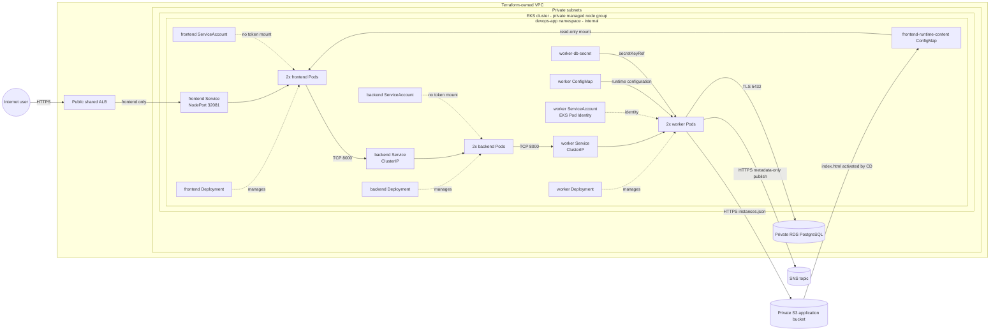

# Kubernetes application Helm charts

The application is deployed as three independent Helm releases in the dedicated
`devops-app` namespace:

| Chart | Workload | Service exposure | Runtime responsibility |
| --- | --- | --- | --- |
| `frontend` | nginx frontend | fixed NodePort `32081`, targeted only by the shared ALB | browser UI and proxy to backend |
| `backend` | FastAPI backend | ClusterIP | validation and orchestration |
| `worker` | FastAPI worker | ClusterIP | PostgreSQL persistence, S3 catalog sync, and SNS notification |

The supported lifecycle deploys these charts through standalone Jenkins CD after
Ansible prepares the namespace, runtime ConfigMaps, Secret, ServiceAccounts, and
AWS identity bindings. Direct Helm commands are for local lint/render validation;
they are not the routine production deployment interface.

## Prerequisites and ownership

The charts intentionally do not create infrastructure or deployment prerequisites:

- Terraform owns EKS, the VPC CNI NetworkPolicy feature, the shared ALB and fixed
  frontend target, RDS, S3, SNS, security groups, and EKS Pod Identity resources.
- Ansible prepares `devops-app`, `worker-db-secret`, the worker Pod Identity
  binding, and non-secret runtime values from Terraform outputs.
- Jenkins CD owns the three Helm releases and the external
  `frontend-runtime-content` ConfigMap populated from the versioned S3
  `index.html` object.

The committed worker values contain non-secret placeholders and are suitable for
lint/render only. A real deployment must inject the RDS endpoint/name/user/port,
AWS region, application bucket, SNS topic ARN, and existing Secret name. The
database password is never a Helm value: Pods read the `password` key from
`worker-db-secret` through `secretKeyRef`.

## Deployment value contract

Standalone CD overrides one immutable image tag for all releases and the following
environment-specific values:

| Chart | Required deployment overrides |
| --- | --- |
| all | `namespace`, `image.repository`, `image.tag` |
| worker | `database.host`, `database.port`, `database.name`, `database.user`, `database.existingSecretName`, `aws.region`, `aws.s3BucketName`, `aws.snsTopicArn` |

Service discovery uses the fixed release names `frontend`, `backend`, and
`worker`, matching the default internal host values. Renaming a release therefore
requires updating the corresponding service host value and NetworkPolicy selector
assumptions together.

Do not pass secret values through `--set`, values files, logs, or archived rendered
manifests. The supported lifecycle creates the Kubernetes Secret before CD and
suppresses secret output.

## Kubernetes application architecture

This diagram documents the Kubernetes application boundary: cluster, VPC/private
subnets and node group, namespace, Deployments, Pods, Services, configuration,
Secrets, identities, managed AWS dependencies, communication direction, and
public/private/internal exposure.



Backend and worker have no public entry points. The Terraform-owned ALB is outside
the Kubernetes ownership boundary and targets only the frontend's stable NodePort.
RDS remains private; S3 and SNS remain managed AWS services outside the cluster.

## Pod and container hardening

All three charts configure:

- pod-level `RuntimeDefault` seccomp;
- non-root containers with privilege escalation disabled and all Linux
  capabilities dropped;
- read-only root filesystems; and
- immutable image tags, readiness/liveness probes, and resource requests/limits.

Frontend receives writable `emptyDir` mounts only for nginx runtime and cache
paths. Worker receives one writable `emptyDir` at `/app/src/worker/configs` for
the generated `instances.json` catalog. Backend needs no writable root path.

Frontend and backend disable ServiceAccount token automount. Worker deliberately
retains token projection because the EKS Pod Identity agent exchanges that
identity for short-lived AWS credentials; its IAM role is limited to the required
S3 object and SNS topic.

## Enforced traffic model

Terraform enables NetworkPolicy support in the EKS VPC CNI add-on. Each chart
creates an ingress-and-egress policy selecting only its own Pods:

| Selected Pods | Allowed ingress | Allowed egress |
| --- | --- | --- |
| frontend | TCP 8080 for the ALB-to-NodePort path | CoreDNS; backend TCP 8000 |
| backend | frontend Pods on TCP 8000 | CoreDNS; worker TCP 8000 |
| worker | backend Pods on TCP 8000 | CoreDNS; PostgreSQL TCP 5432; HTTPS TCP 443; EKS Pod Identity agent `169.254.170.23:80` |

These policies default-deny unspecified ingress and egress for selected Pods.
They are one layer rather than a complete identity firewall:

- frontend ingress is port-restricted instead of source-CIDR-restricted because
  ALB-to-NodePort source enforcement belongs to the ALB/node security groups;
- worker PostgreSQL and HTTPS egress rules restrict ports, while RDS security
  groups and workload IAM enforce the allowed destination/resource identity; and
- node-originated health probes follow the EKS VPC CNI/Kubernetes node-traffic
  behavior and must be reverified in the clean E2E deployment.

## Release behavior and verification

FULL CD validates and renders every chart before changing workloads, then upgrades
the dependency chain in this order: `worker`, `backend`, `frontend`. Each release
uses `--atomic --wait --timeout 5m --history-max 10`, so a failed release upgrade
rolls back instead of leaving that release partially ready. The three releases are
still independent transactions; a later failure does not undo an earlier
successful release, and rerunning CD reconciles the desired immutable tag.

After deployment, verify release and workload health without displaying Secrets:

```bash
helm list -n devops-app
kubectl get deployments,pods,services,networkpolicies -n devops-app
kubectl rollout status deployment/worker -n devops-app --timeout=5m
kubectl rollout status deployment/backend -n devops-app --timeout=5m
kubectl rollout status deployment/frontend -n devops-app --timeout=5m
```

The functional acceptance path must also prove public frontend access,
frontend-to-backend-to-worker communication, PostgreSQL persistence, encrypted S3
catalog synchronization, SNS publication, and recovery after replacing one Pod.
Those end-to-end checks belong to the guarded lifecycle rather than direct Helm
testing.

## Local chart validation

From the repository root:

```bash
helm lint helm/frontend
helm lint helm/backend
helm lint helm/worker
helm template frontend helm/frontend --namespace devops-app >/dev/null
helm template backend helm/backend --namespace devops-app >/dev/null
helm template worker helm/worker --namespace devops-app >/dev/null
```

See the root [README](../README.md) for the full AWS/Jenkins architecture,
supported lifecycle, verification evidence, and security trade-offs.
